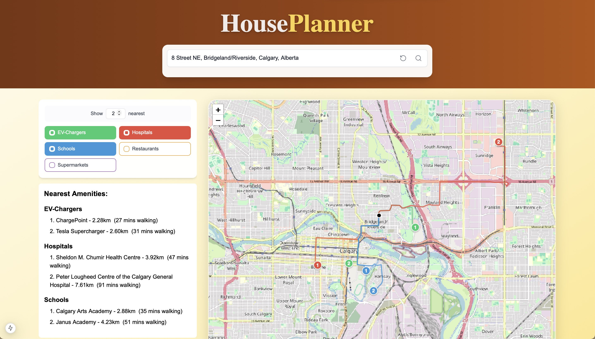

# HousePlanner

## Overview
**HousePlanner** is a sophisticated web application designed to help users explore and evaluate locations by visualizing nearby amenities. Whether you're house hunting, researching neighborhoods, or planning a move, this tool provides detailed insights about essential services and their accessibility from any chosen location worldwide.

## Key Features

### Location Selection
- **Current Location Detection**: Automatically detects and uses your current location
- **Address Search**: Search for any address or location worldwide
- **Interactive Map Selection**: Click anywhere on the map to analyze that location
- **Global Coverage**: Works in any location worldwide with OpenStreetMap coverage

### Amenity Discovery
- **Multiple Amenity Types**:
  - 🏥 Hospitals
  - 🏫 Schools
  - 🍽️ Restaurants
  - 🏪 Supermarkets
  - ⚡ EV Charging Stations

- **Customizable Search**:
  - Adjust the number of nearest locations to display (1-20)
  - Toggle different amenity types independently
  - Color-coded markers for easy identification

### Route Analysis
- **Real Walking Routes**: Shows actual walking paths along streets (not just straight lines)
- **Distance Calculations**: 
  - Accurate walking distances
  - Estimated walking times
  - Estimated driving times
- **Visual Route Display**: Color-coded paths for different amenity types

### Information Display
- **Interactive Markers**:
  - Numbered markers indicating proximity order
  - Hover tooltips with detailed information
  - Click for persistent information display
- **Detailed Information**:
  - Full address when available
  - Exact distance in kilometers
  - Walking time estimates
  - Driving time estimates
  - Facility names and details

### User Interface
- **Clean, Modern Design**:
  - Intuitive controls
  - Responsive layout
  - Mobile-friendly interface
- **Real-time Updates**:
  - Loading indicators
  - Dynamic results
  - Instant visual feedback

## Technical Details

### Technologies
- **Frontend Framework**: Next.js 13+ with React
- **Mapping**: Leaflet.js with React-Leaflet
- **Styling**: Tailwind CSS
- **Icons**: Lucide React
- **APIs**:
  - OpenStreetMap for base maps
  - Nominatim for geocoding
  - Overpass for amenity data
  - OSRM/GraphHopper for routing

### Key Components
- Dynamic map rendering with SSR support
- Geolocation services integration
- Address autocomplete
- Route calculation and optimization
- Distance and time estimations

### Performance Features
- Dynamic loading of map components
- Debounced search inputs
- Optimized marker rendering
- Sequential route fetching
- Fallback mechanisms for routing services

## Getting Started

### Prerequisites
- Node.js 16.0 or later
- npm or yarn
- Git

### Installation
1. **Clone the Repository**
   ```sh
   git clone https://github.com/yourusername/house-planner.git
   cd house-planner
   ```

2. **Install Dependencies**
   ```sh
   npm install
   # or
   yarn install
   ```

3. **Start the Development Server**
   ```sh
   npm start
   # or
   yarn start
   ```

4. **Open in Browser**
   Navigate to `http://localhost:3000` to access the tool.

## Usage
1. Enter an address in the input field and press "Search."
2. The map will update with the address location.
3. Select amenities using checkboxes to display them on the map.
4. The tool will fetch nearby amenities and display them with markers.
5. Clicking on a marker will show the name and walking distance from the given address.
6. A highlighted route from the address to the selected amenity will be shown.

## Home Screen



## Configuration
- If using an API key for external services (e.g., Nominatim, Overpass API), ensure it's set up in an `.env` file.
- Customize map appearance and controls by modifying the Leaflet settings in the source code.

## Future Enhancements
- Add filtering options based on distance thresholds.
- Support for additional amenities.
- Optimize performance for large-scale queries.

## Contributing
Contributions are welcome! Follow these steps:
1. Fork the repository.
2. Create a feature branch (`git checkout -b feature-name`).
3. Commit your changes (`git commit -m "Add new feature"`).
4. Push to the branch (`git push origin feature-name`).
5. Open a pull request.

## License
This project is licensed under the MIT License.


